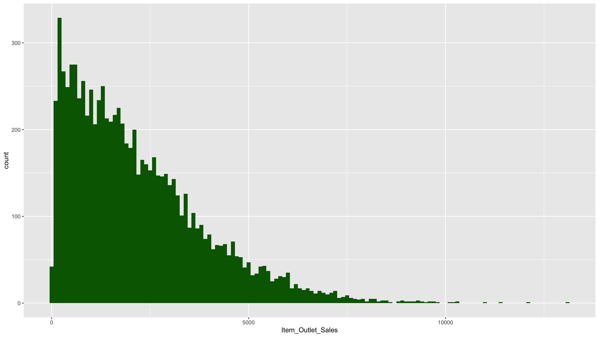
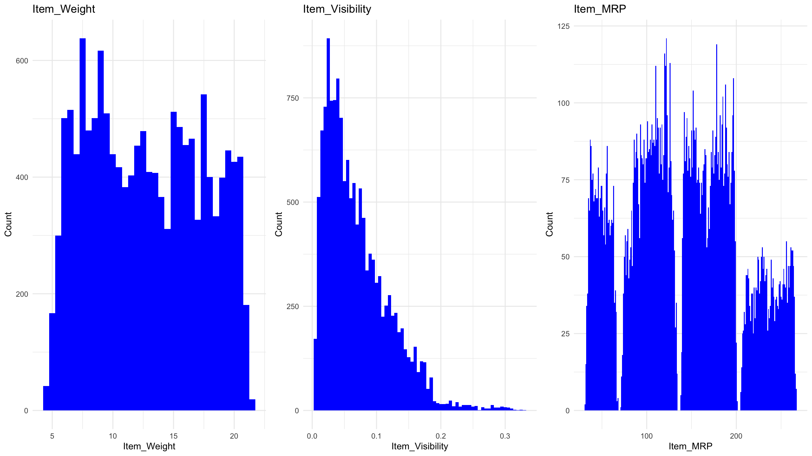
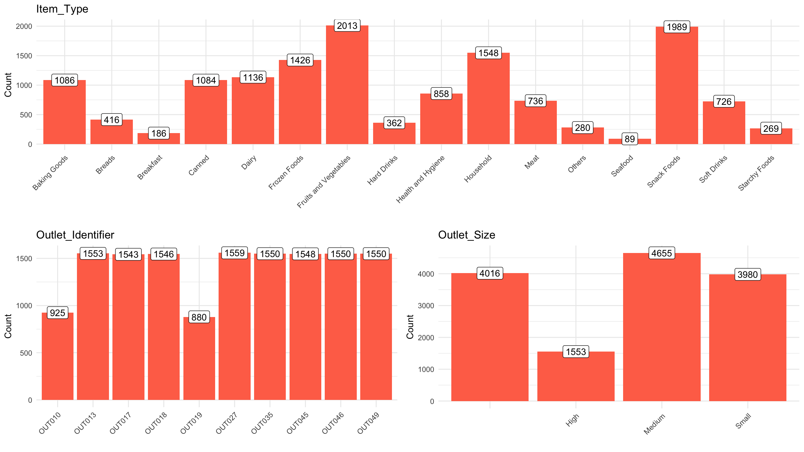
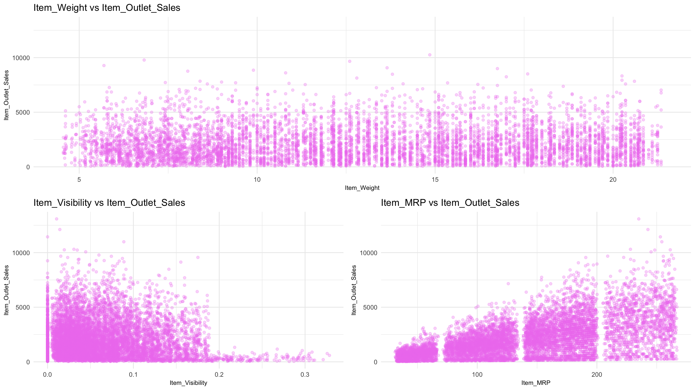
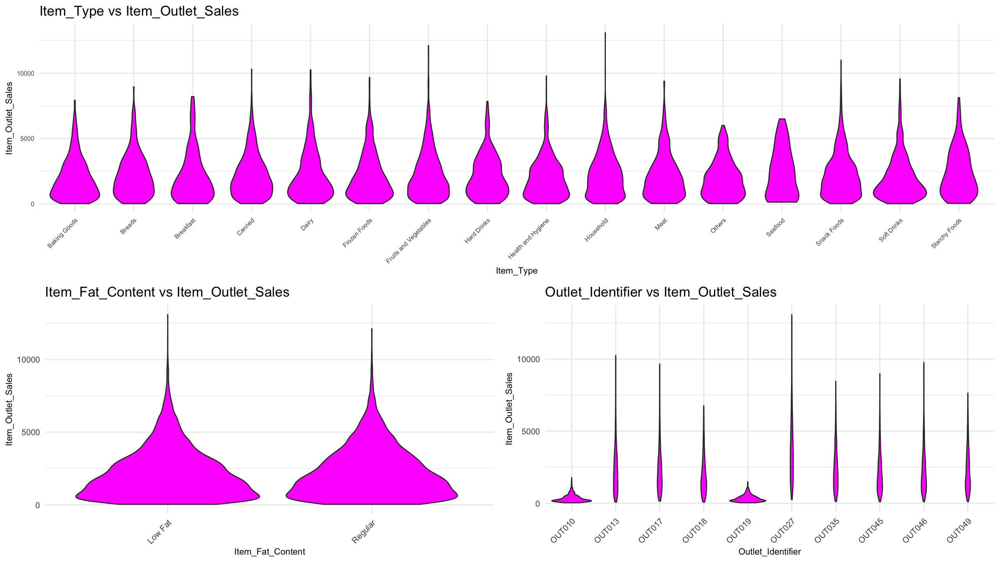
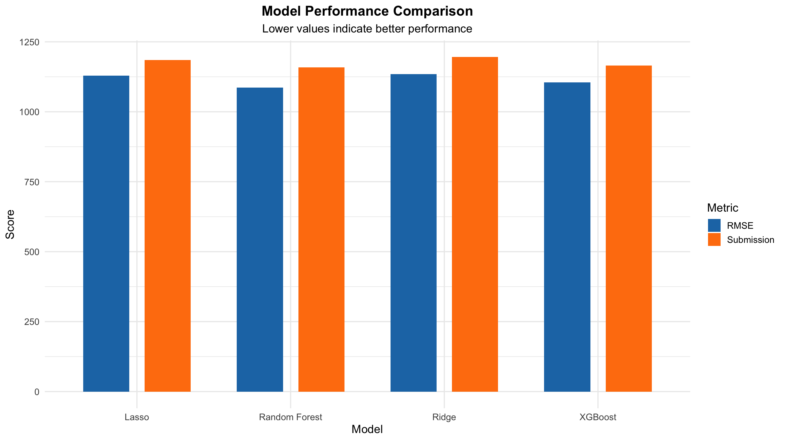
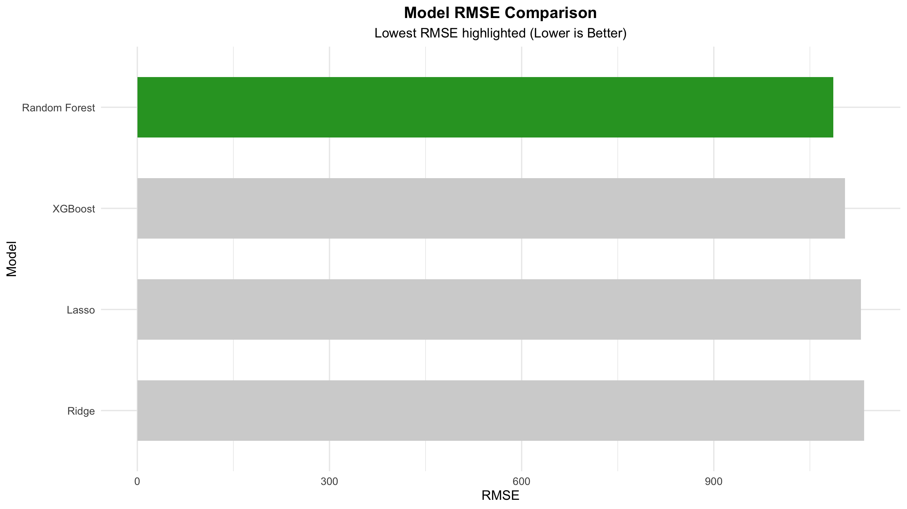
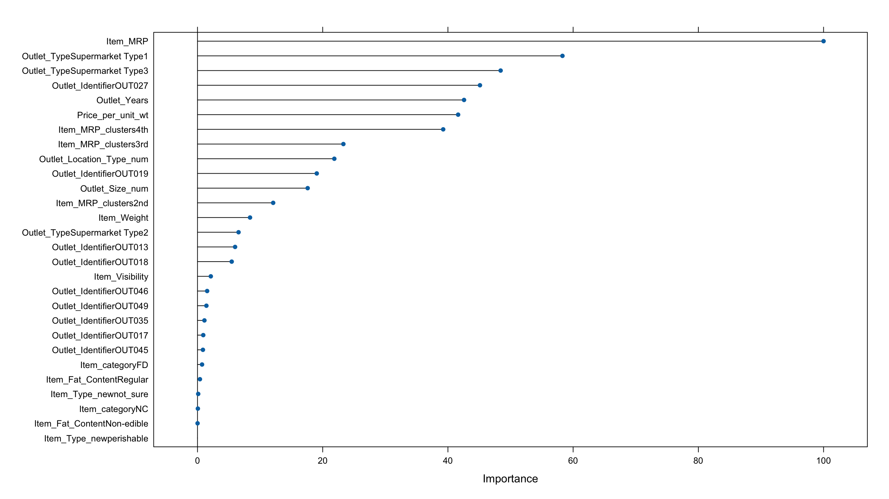
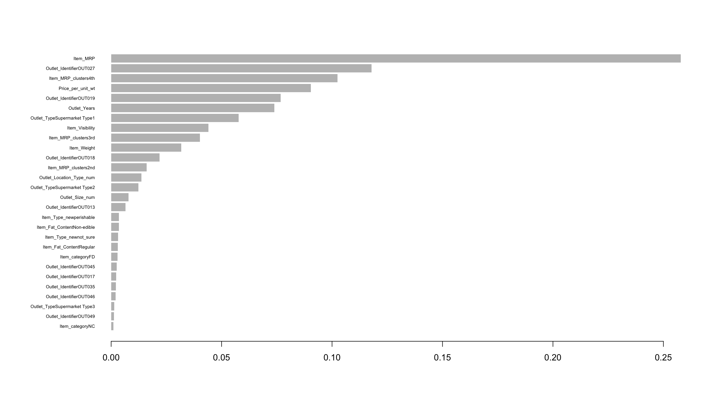

# 🛒 Big Mart Sales Prediction using R

🔗 **Hackathon Link:**
[Click Here!](https://www.analyticsvidhya.com/datahack/contest/practice-problem-big-mart-sales-iii/)

📖 **Non-Technical Case Study (Notion Version)**:
[Click here!](https://absorbing-sight-c8d.notion.site/Big-Mart-Sales-Prediction-30b705565b448081a254cf7eef7b9b1a)

---

## 📌 Project Overview

This project builds an end-to-end machine learning pipeline in **R** to predict product-level sales across Big Mart outlets.

The dataset contains **2013 sales data for 1559 products across 10 stores**, along with detailed product and outlet attributes.

The objective is to:

> **Predict `Item_Outlet_Sales` for each product-outlet combination.**

The model helps BigMart:

* Identify key drivers of sales
* Optimise pricing and visibility strategies
* Improve inventory planning
* Understand store-level performance differences

---

## 🧠 Hypothesis Generation

Before modelling, domain-driven hypotheses were formulated across four levels:

---

### 🏬 Store-Level Hypotheses

* Stores in **urban / Tier 1 cities** may generate higher sales.
* Higher **population density** may increase demand.
* Larger stores may act as **one-stop shops**, increasing revenue.
* More competitors nearby may reduce sales.
* Better marketing may improve visibility and revenue.
* Well-maintained stores may increase customer footfall.

---

### 📦 Product-Level Hypotheses

* Branded products may have higher trust and sales.
* Better packaging may attract customers.
* Daily-use items may sell more frequently.
* Shelf placement and visibility impact sales.
* Promotions and advertising increase demand.

---

### 👤 Customer-Level Hypotheses

* Stores aligned with local customer preferences may perform better.
* Higher-income customers may purchase higher-value products.
* Larger family sizes may increase spending.
* Past purchase patterns influence future sales.

---

### 🌍 Macro-Level Hypotheses

* Economic growth may increase purchasing power.
* Government regulations and environment awareness may affect buying behaviour.

---

# ⚙️ Project Structure

```
BigMart_Sales/
│
├── Bigmart_Sales_Prediction.Rproj
├── bigmart_sales_prediction.Rmd
├── scripts/
│   ├── 00_libraries.R
│   ├── 01_data_loading_cleaning.R
│   ├── 02_eda.R
│   ├── 03_models.R
│   ├── 04_results.R
│
├── datasets/
├── submission/
├── renv.lock
├── .gitignore
└── README.md
```

---

# 🔧 Environment Setup

This project uses **renv** for reproducibility.

### 1️⃣ Clone Repository

```bash
git clone <repo-link>
```

### 2️⃣ Restore Environment

```r
renv::restore()
```

This ensures all packages and versions match the original project environment.

---

# 📊 Data Pipeline

The workflow is modular and structured through separate scripts:

---

## 1️⃣ Data Loading & Cleaning

📄 `01_data_loading_cleaning.R`

* Load train, test, and submission datasets
* Combine datasets for unified preprocessing
* Handle missing values
* Replace zero visibility values
* Prepare data for feature engineering

---

## 2️⃣ Exploratory Data Analysis

📄 `02_eda.R`

### Univariate Analysis

* Distribution of sales
* Numerical variable histograms
* Categorical frequency plots

<p align="center">
  
</p>
<p align="center"><i>Figure 1: Distribution of target variable.</i></p>

<p align="center">
  
</p>
<p align="center"><i>Figure 2: Distribution of numerical variables.</i></p>

<p align="center">
  
</p>
<p align="center"><i>Figure 3: Distribution of categorical variables.</i></p>

---

### Bivariate Analysis

* Sales vs numerical variables (scatter plots)
* Sales vs categorical variables (violin plots)

<p align="center">
  
</p>
<p align="center"><i>Figure 4: Relationship between target and numerical variables.</i></p>

<p align="center">
  
</p>
<p align="center"><i>Figure 5: Relationship between target and categorical variables.</i></p>

---

## 3️⃣ Feature Engineering

Created meaningful new features:

* `Item_Type_new`
* `Item_category`
* `Outlet_Years`
* `Price_per_unit_wt`
* `Item_MRP_clusters`

Additional preprocessing:

* Log transformations for skewed variables
* Scaling numeric features
* Encoding categorical variables (Label + One-Hot Encoding)

---

# 🤖 Modelling

📄 `03_models.R`

Evaluation Metric: **RMSE (Root Mean Squared Error)**
Lower RMSE indicates better performance.

Models built:

1. Linear Regression
2. Lasso Regression
3. Ridge Regression
4. Random Forest
5. XGBoost

---

# 📈 Model Performance

| Model         | RMSE         | Submission Score |
| ------------- | ------------ | ---------------- |
| Lasso         | 1129.527     | 1185.455         |
| Ridge         | 1134.585     | 1195.369         |
| Random Forest | **1086.488** | **1158.289**     |
| XGBoost       | 1104.560     | 1164.868         |

---

## 📊 Performance Comparison Chart

<p align="center">
  
</p>
<p align="center"><i>Figure 6: Comparison between RMSE and Submission scores across all models.</i></p>

<p align="center">
  
</p>
<p align="center"><i>Figure 7: RMSE scores sorted lowest to highest.</i></p>

<p align="center">
  
</p>
<p align="center"><i>Figure 8: Submission scores sorted lowest to highest.</i></p>

---

# 🏆 Best Model

**Random Forest** achieved:

* ✅ Lowest RMSE (1086.488)
* ✅ Best submission score (1158.289)

This indicates:

* Strong generalisation performance
* Robust handling of non-linear relationships
* Effective feature utilisation

---

# 📊 Feature Importance

Random Forest and XGBoost were used to analyse feature importance.

<p align="center">
  
</p>
<p align="center"><i>Figure 9: Variables importance in Random Forest model.</i></p>

<p align="center">
  
</p>
<p align="center"><i>Figure 10: Variables importance in XGBoost model.</i></p>

---

# 📌 Key Insights

* Feature engineering significantly improved performance.
* Tree-based models outperformed linear models.
* Non-linear relationships strongly influence sales.
* Price per unit weight and outlet characteristics are key drivers.

---

# 🚀 Technologies Used

* R
* data.table
* dplyr
* ggplot2
* caret
* ranger
* xgboost
* corrplot
* renv

---

# 📈 Future Improvements

* Hyperparameter tuning with Bayesian optimisation
* Ensemble stacking of top models
* Feature interaction modelling
* Time-series integration if historical data becomes available

---

# 👤 Author

**Hamza Latif**

---
